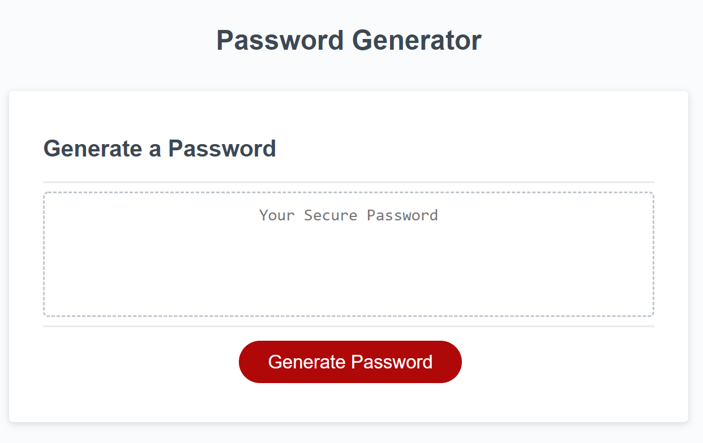

# password_generator
## Description 

The Password Generator project is an application that enables employees to generate random passwords based on the criteria that they’ve selected. The app runs in the browser with a feature that dynamically updates HTML and CSS. It has a clean and polished, responsive user interface that adapts to multiple screen sizes.


## Installation

There are no specific installation instructions. However, the Password Generator Application is hosted on Github. Below is the URL to the webpage. 

URL: https://synag.github.io/password_generator/

Github repository: https://github.com/synag/password_generator

Folders and Files
- ReadMe: Password Generator instruction
- Index.html: Password Generator
- Asset Folder (Image folder, CSS folder and js folder)


## Usage and Demo 

Minimum usage requirements. 

Below is the Password Generator screenshot, the image shows the web application's appearance and functionality:




## Credits

No additional developers worked on this project. However, I did use the following tools and resources. 

Tools: HTML, CSS javaScript

I also used the w3school (https://www.w3schools.com/)  and OWASP Foundation (https://www.owasp.org/index.php/Password_special_characters) as a resources.


## License

Exclusive rights to the source are granted to Carl Benbnow as the developer and owner of the Password Generator site.


## User Story and DOD Compliance


```


AS AN employee with access to sensitive data
I WANT to randomly generate a password that meets certain criteria
SO THAT I can create a strong password that provides greater security


Acceptance Criteria (Done)


GIVEN I need a new, secure password
WHEN I click the button to generate a password
THEN I am presented with a series of prompts for password criteria
WHEN prompted for password criteria
THEN I select which criteria to include in the password
WHEN prompted for the length of the password
THEN I choose a length of at least 8 characters and no more than 128 characters
WHEN prompted for character types to include in the password
THEN I choose lowercase, uppercase, numeric, and/or special characters
WHEN I answer each prompt
THEN my input should be validated and at least one character type should be selected
WHEN all prompts are answered
THEN a password is generated that matches the selected criteria
WHEN the password is generated
THEN the password is either displayed in an alert or written to the page


Definition of Done:


Technical Acceptance Criteria (Done)

* Satisfies all of the above acceptance criteria plus the following code improvements:
  * Application's links all function correctly.
  * Application's CSS selectors and properties are consolidated and organized to follow semantic structure.
  * Application's CSS file is properly commented.

Deployment (Done)
* Application deployed at live URL using GitHub Pages.
* Application loads with no errors.
* Application GitHub URL submitted.
* GitHub repository that contains application code.


Application Quality (Done)
* Application resembles (at least 90%) screenshots provided in the homework instructions.

Repository Quality (Done)

* Repository has a unique name.
* Repository follows best practices for file structure and naming conventions.
* Repository follows best practices for class/id naming conventions, indentation, quality comments, etc.
* Repository contains multiple descriptive commit messages.
* Repository contains quality README file with description, screenshot, and link to deployed application.
